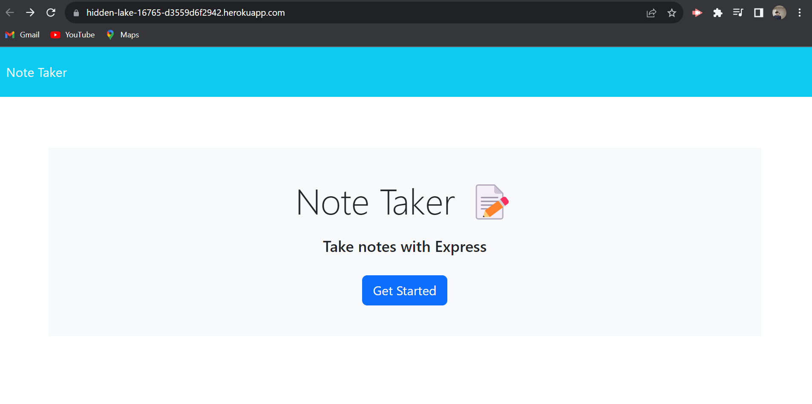
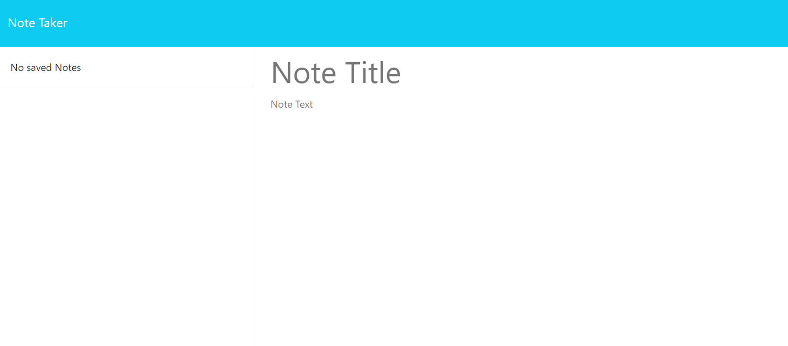

# Note Taker 

## Description
This project allows the users to type in notes and save it to view later. The project uses express done through the local host rather than the html live server. The motivation 

## Installation
Run the command npm i to install necessary packages to run this code.

https://hidden-lake-16765-d3559d6f2942.herokuapp.com/ This is the deployed link for this application.
https://github.com/Ericlee1783/Note-Taker This is the repo on Github for this application.

## Usage
 
 